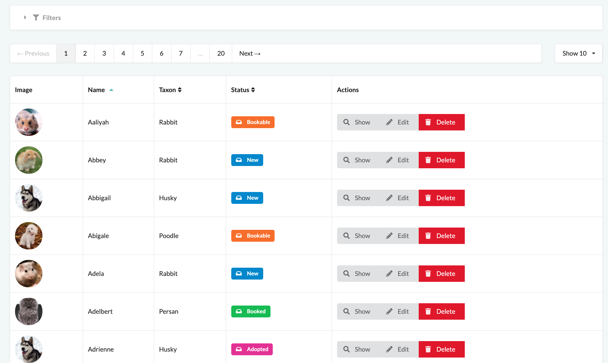

# Chapter 4 - Grids



## Basic example {#basic-example}
```yaml
# config/sylius/grids/backend/article.yaml
sylius_grid:
    grids:
        app_backend_article:
            driver:
                name: doctrine/orm
                options:
                    class: "%app.model.article.class%"
            sorting:
                title: asc
            fields:
                title:
                    type: string
                    label: sylius.ui.title
                    sortable: null
            filters:
                search:
                    type: string
                    label: sylius.ui.search
                    options:
                        fields: [title]
            actions:
                main:
                    create:
                        type: create
                item:
                    update:
                        type: update
                    delete:
                        type: delete
```

<div markdown="1" class="block-warning">
You need to clear the Symfony cache when creating a new sylius grid configuration file.
</div>


## Manually importing your Grids' configuration (optional) {#manually-importing-grids}

Grids configuration files are automatically detected when clearing the cache. You can manually add them if you prefer.

```yaml
# config/sylius/grids.yaml
imports:
    - { resource: 'grids/backend/article.yaml' }
    - { resource: 'grids/backend/admin_user.yaml' }
    - { resource: 'grids/backend/customer.yaml' }
```

## Advanced example {#advanced-example}

This configuration is the one used on our demo to show pets list on admin panel.

```yaml
sylius_grid:
    grids:
        app_backend_pet:
            driver:
                name: doctrine/orm
                options:
                    class: '%app.model.pet.class%'
                    repository:
                        method: createListQueryBuilder
                        arguments: [$taxonId, '%locale%']
            sorting:
                name: asc
            fields:
                image:
                    type: twig
                    label: sylius.ui.image
                    path: .
                    options:
                        template: "backend/pet/grid/field/image.html.twig"
                name:
                    type: string
                    label: sylius.ui.name
                    sortable: null
                taxon:
                    type: string
                    label: app.ui.taxon
                    sortable: null
                    path: taxon.translation.name
                status:
                    type: twig
                    label: sylius.ui.status
                    sortable: null
                    options:
                        template: "@SyliusUi/Grid/Field/state.html.twig"
                        vars:
                            labels: "backend/pet/label/state"
            filters:
                search:
                    type: string
                    label: sylius.ui.search
                    options:
                        fields: [name, slug]
            actions:
                main:
                    create:
                        type: create
                item:
                    show:
                        type: show
                    update:
                        type: update
                    delete:
                        type: delete

```

## Learn More {#learn-more}
* [Configuring grid in sylius documentation](https://github.com/Sylius/SyliusGridBundle/blob/master/docs/index.md)
* [The whole configuration reference in sylius documentation](https://github.com/Sylius/SyliusGridBundle/blob/master/docs/configuration.md)
